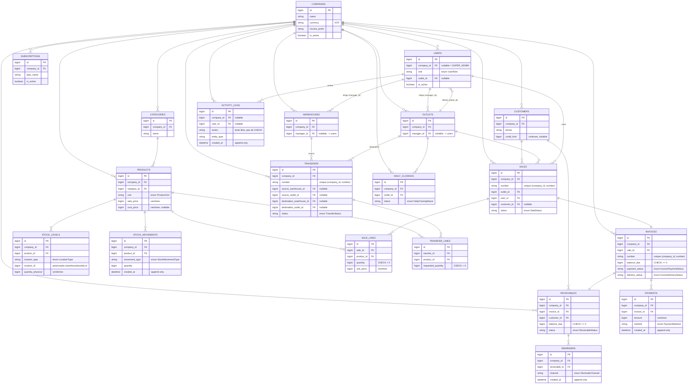

# IKOMA STOCK — Schéma de données

SaaS de gestion commerciale multi-entreprises (quincaillerie, bois, ciment) en
FCFA (XOF), construit sur Laravel 13 / MySQL 8 / Livewire 3. Ce document
couvre les fondations posées dans cette itération : migrations, modèles,
isolation multi-tenant, seeders, factories et tests. Les écrans Livewire,
l'API, les PDF de factures et le PWA ne sont pas couverts ici.

## Décisions actées en cours de route

| Sujet | Brief initial | Décision retenue | Pourquoi |
|---|---|---|---|
| SGBD | PostgreSQL 16 | **MySQL 8.0** | Demandé explicitement par l'utilisateur en cours de tâche. |
| Laravel | v11 | **v13** (dernière stable) | Toutes les versions 11.x ont désormais des advisories de sécurité non corrigées ; Composer refuse de les installer. v13 conserve la structure `bootstrap/app.php` de v11. |
| Livewire | v3 | v3.8 (pinné) | Composer résolvait v4 par défaut ; le brief demande explicitement v3. |
| Tailwind | v3 | v3.4 (pinné, PostCSS classique) | Le scaffold Laravel par défaut installe Tailwind v4 (`@tailwindcss/vite`) ; reconfiguré en `tailwind.config.js` + `postcss.config.js` classiques. |
| Tests | Pest | Pest **core** uniquement (pas `pestphp/pest-plugin-laravel`) | Le plugin Laravel de Pest n'a pas encore de version stable compatible Laravel 13 (sa branche `5.x` exige PHP 8.4, nous sommes en 8.3). `tests/Pest.php` étend directement `Tests\TestCase` + `RefreshDatabase`, ce qui suffit pour des tests Feature Laravel standards. |
| Déploiement cible | — | **o2switch (VPS cPanel)** | Précisé par l'utilisateur en cours de tâche ; à traiter dans un prompt de suivi séparé. |

## Modèle multi-tenant

- **`current_company_id()`** (`app/helpers.php`) : résout la société courante
  — `auth()->user()->company_id` si connecté (peut être `null` pour un
  SUPER_ADMIN), sinon `null` (contexte console/seeders). Une valeur `null`
  signifie *aucune restriction*, jamais "aucune société trouvée".
- **`App\Traits\BelongsToTenant`** : applique `App\Models\Scopes\CompanyScope`
  (filtre `company_id = current_company_id()` uniquement si non-null) et
  auto-remplit `company_id` à la création si absent. Appliqué à tous les
  modèles métier possédant une colonne `company_id`, sauf `Company`
  elle-même.
- **`SaleLine` et `TransferLine`** n'ont pas de colonne `company_id` (fidèle
  au brief) : leur isolation tenant passe par leur parent (`Sale`/`Transfer`).
- **`App\Http\Middleware\EnsureTenantAccess`** (alias `tenant`) : défense en
  profondeur — si un modèle lié à la route a été résolu en contournant le
  scope (`withoutGlobalScopes()`), vérifie explicitement que son
  `company_id` correspond à celui de l'utilisateur connecté. Un SUPER_ADMIN
  (`company_id === null`) passe toujours.
- **`App\Http\Middleware\SuperAdminOnly`** (alias `super-admin`) : réservé
  aux routes d'administration plateforme.
- **`App\Traits\HasAudit`** : journalise `created`/`updated`/`deleted` dans
  `ActivityLogs` (anciennes/nouvelles valeurs, utilisateur, IP, device,
  session). Volontairement absent sur les tables déjà append-only
  (`StockMovement`, `Payment`, `Reminder`, `ActivityLog` lui-même) pour
  éviter un double journal, et sur `StockLevel` (état courant recalculé,
  déjà tracé par `StockMovement`).

## Diagramme entité-relation

## Enums (PHP backed enums, `app/Enums/`)

Chaque enum expose `values(): array` (trait `EnumValues`) — source unique
réutilisée à la fois par les casts Eloquent et par les contraintes `CHECK`
générées dans les migrations.

| Enum | Valeurs |
|---|---|
| `UserRole` | SUPER_ADMIN, ADMIN_COMPANY, OUTLET_MANAGER, SELLER, WAREHOUSE_KEEPER |
| `ProductUnit` | UNIT, BAR, TON, KG, BAG, SHEET, METER, M3, PLANK, PACK |
| `LocationType` | WAREHOUSE, OUTLET |
| `StockMovementType` | INITIAL_ENTRY, SUPPLY, SALE_DELIVERY, OLD_SALE_DELIVERY, TRANSFER_OUT, TRANSFER_IN, CUSTOMER_RETURN, LOSS, BREAKAGE, INVENTORY_CORRECTION, AUTHORIZED_CANCELLATION |
| `CustomerType` | REGISTERED, PASSING |
| `SaleStatus` | DRAFT, VALIDATED, CANCELLED |
| `PaymentMethod` | CASH, MOBILE_MONEY, BANK_TRANSFER, CHECK, CUSTOMER_CREDIT, OTHER |
| `InvoicePaymentStatus` | UNPAID, PARTIAL, PAID, OVERDUE, CANCELLED |
| `InvoiceDeliveryStatus` | TO_PREPARE, READY, PARTIAL_DELIVERED, DELIVERED, CANCELLED |
| `ReceivableStatus` | OPEN, PARTIAL, PAID, OVERDUE |
| `ReminderChannel` | WHATSAPP, CALL, SMS, EMAIL, VISIT |
| `TransferStatus` | DRAFT, REQUESTED, ACCEPTED, IN_PREPARATION, SHIPPED, RECEIVED, PARTIALLY_RECEIVED, CANCELLED |
| `DailyClosingStatus` | OPEN, PENDING_VALIDATION, VALIDATED, REJECTED |

`ActivityLogs.action` reste volontairement une colonne texte libre, sans
enum ni CHECK : le brief ne fige pas sa liste de valeurs, et de nouvelles
actions apparaîtront avec les futurs modules métier.

## Contraintes DB

- `CHECK` : `balance_due >= 0` (invoices, receivables) ; `paid_amount <=
  total_amount` (invoices) ; `quantity > 0` (sale_lines, transfer_lines
  [`requested_quantity`], stock_movements) ; toutes les colonnes enum
  (`role`, `unit`, `status`, `method`, `channel`...) via `IN (...)`.
- `UNIQUE(company_id, number)` sur `sales`, `invoices`, `transfers` — deux
  sociétés peuvent réutiliser le même numéro, jamais la même société deux
  fois.
- `UNIQUE(product_id, location_type, location_id)` sur `stock_levels`.
- `UNIQUE(company_id, email)` sur `users` — deux sociétés différentes
  peuvent avoir un utilisateur avec le même e-mail (cohérent avec un vrai
  modèle multi-tenant), mais pas la même société deux fois.
- Toutes les clés étrangères sont `ON DELETE RESTRICT` (`restrictOnDelete()`)
  — jamais de suppression en cascade.
- Dépendance circulaire `users.outlet_id` ↔ `outlets` : la colonne est créée
  sans contrainte dans `create_users_table`, la FK est ajoutée dans une
  migration séparée `add_outlet_foreign_to_users_table` une fois `outlets`
  créée.

## Table technique additionnelle : `document_sequences`

Non présente dans le brief — ajoutée pour que `App\Services\
DocumentNumberGenerator` génère des numéros `PREFIX-YYYYMM-NNNN` sans
collision, y compris pour le tout premier document d'une période (un simple
`MAX(number)` + `lockForUpdate()` ne verrouille rien s'il n'existe encore
aucune ligne à verrouiller). Compteur par `(company_id, document_type,
period)`, verrouillé en transaction (`SELECT ... FOR UPDATE`). Ce n'est pas
une entité métier, juste un détail d'implémentation interne au service.

## Seed de démonstration

`php artisan migrate:fresh --seed` crée :

- 1 SUPER_ADMIN plateforme (`superadmin@ikoma-stock.test`, voir la sortie
  console pour le mot de passe généré à l'exécution).
- 2 entreprises (Quincaillerie Koné, Bois & Ciment Touré), chacune avec 1
  admin, 2 vendeurs, 1 magasinier, 2 points de vente, 1 dépôt, 3 catégories,
  10 produits (prix FCFA réalistes fer/bois/ciment), 5 clients, et un
  historique minimal (mouvements de stock initiaux, 5 ventes dont 2 à
  crédit avec créance ouverte, 1 transfert dépôt→point de vente reçu, 1
  point de journée validé, 1 abonnement actif).
- Les `image_path` de démonstration (produits, catégories, logos) sont des
  chemins placeholder (`products/placeholder.svg`...) — aucun fichier image
  réel n'est généré, hors périmètre de cette tâche.

## Tests

`vendor/bin/pest` (ou `php artisan test`) exécute :

- `tests/Feature/TenantIsolationTest.php` — un utilisateur d'une société ne
  voit/modifie jamais les données d'une autre, y compris quand un code
  hypothétique aurait contourné le scope global (`EnsureTenantAccess`) ;
  vérifie aussi le comportement SUPER_ADMIN et `SuperAdminOnly`.
- `tests/Feature/DatabaseConstraintsTest.php` — les contraintes `CHECK` et
  `UNIQUE` listées ci-dessus sont bien imposées par MySQL, pas seulement par
  Eloquent.
